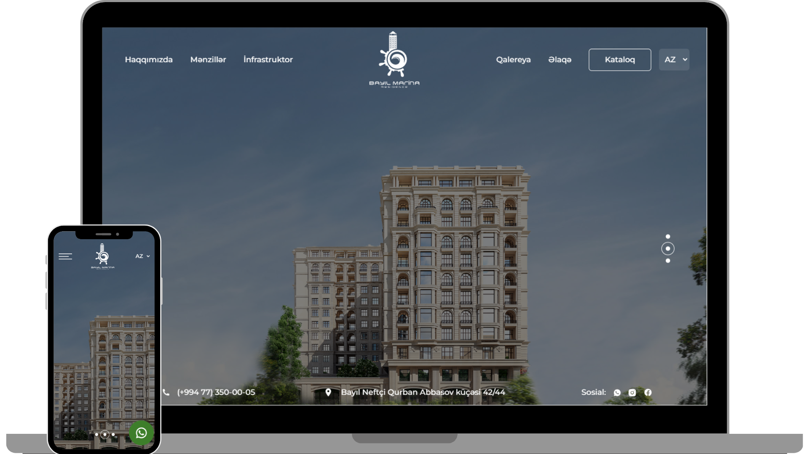

<h2 align="center">
  Bayil Marina Residence  
  <a href="https://one-studio-task.surge.sh/" target="_blank">Surge.sh</a>
</h2>

  

## Built With

- React.js
- React Router
- Swiper
- React Helmet
- Redux
- Framer Motion
- json-server
  
  

## Features

**🎨 Styled with Tailwind CSS**

**📱 Fully Responsive**

## 🛠 Installation and Setup Instructions

1. Installation: `npm install`

2. In the project directory, you can run: `npm run dev`

3. Need to go to the "api" folder and type "json-server --watch db.json" for run json-server

